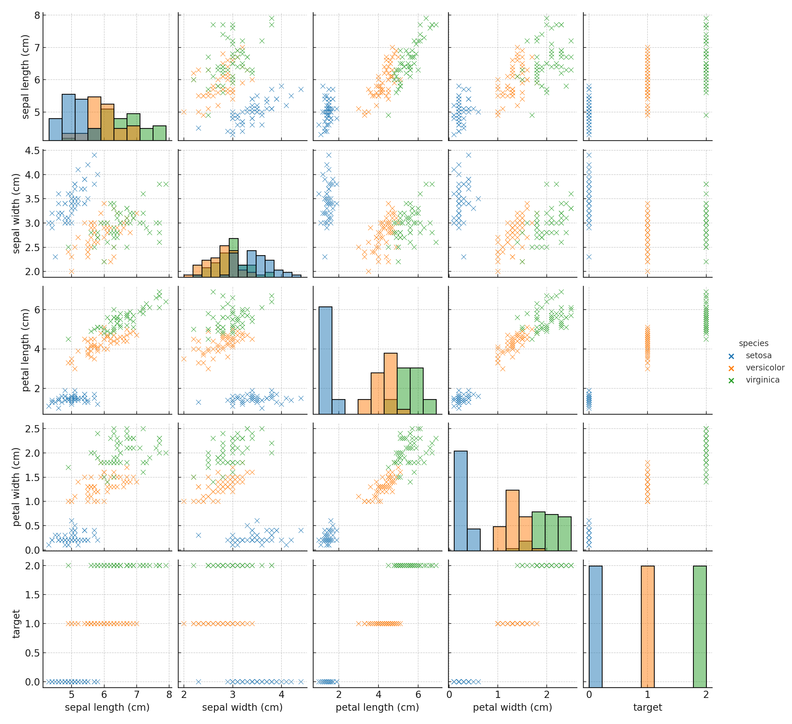
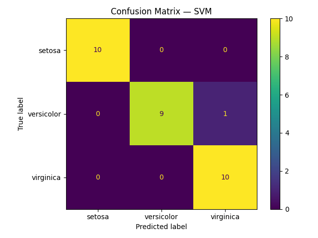
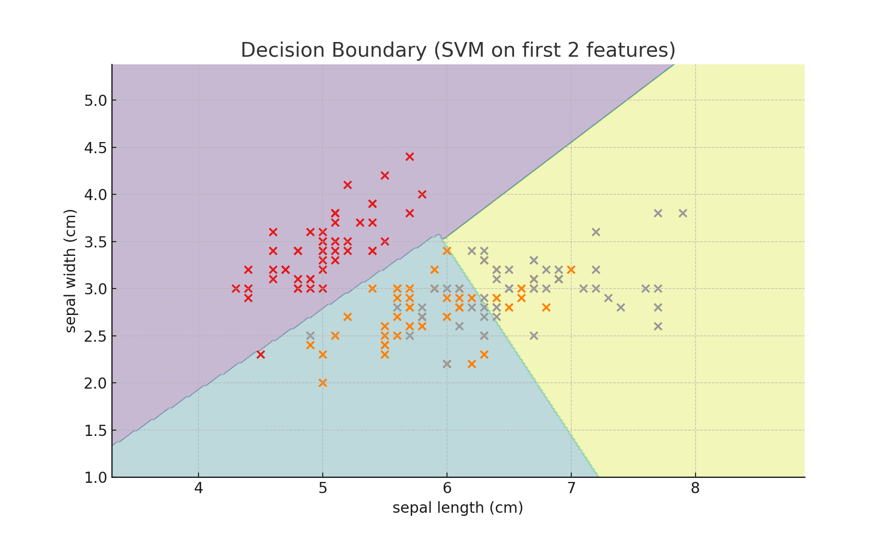

# 🌸 Iris Flower Classification (Pro Version)

 
 


This project classifies iris flowers into **Setosa, Versicolor, and Virginica** using multiple ML models.  
It demonstrates a complete **end-to-end ML workflow**:  
**EDA → Preprocessing → Model Training → Hyperparameter Tuning → Evaluation → Visualization.**

---

## ✨ What's New in the Pro Version
- 📊 **Data Visualization** (pairplots, feature distributions)  
- 🔄 **Cross-validation (5-fold CV)** for reliable evaluation  
- 🔍 **Hyperparameter Tuning** with GridSearchCV (KNN, Decision Tree)  
- 🧠 Added **Support Vector Machine (SVM)** → Best model  
- 🎨 **Decision Boundary Plot** (first 2 features)  
- 📑 Clearer results summary & professional structure  

---

## 📊 Results

### Cross-validation Accuracy
| Model                   | CV Accuracy |
|--------------------------|-------------|
| **SVM**                  | **0.9667** |
| Logistic Regression      | 0.9600      |
| KNN (k=5)                | 0.9600      |
| Decision Tree (depth=4)  | 0.9533      |

### Best Hyperparameters
```python
{'KNN': {'clf__n_neighbors': 5}, 'DecisionTree': {'max_depth': 4}}
````

👉 **Best Model:** **SVM** (97% test accuracy)

---

## 🖼️ Visual Highlights

| Pairplot                          | Confusion Matrix (SVM)                            | Decision Boundary (SVM)                             |
| --------------------------------- | ------------------------------------------------- | --------------------------------------------------- |
|  |  |  |

---

## 📂 Project Structure

```
iris_project_pro/
│── data/
│   └── iris.csv
│── figures/
│   ├── pairplot.png
│   ├── feature_distributions.png
│   ├── confusion_matrix.png
│   └── decision_boundary.png
│── src/
│   └── iris_classification.py
│── Iris_Classification_Summary_Report.pdf
│── requirements.txt
│── README.md
```

---

## 📝 Conclusion

* ✅ **SVM** was the best model (97% accuracy).
* ✅ Demonstrates **end-to-end ML workflow**.
* ✅ Includes **visualization, tuning, and reproducible results**.
* ✅ Project is professional & internship-ready.

---

## 🌱 Future Enhancements

* 🚀 Deploy as a **Streamlit or Flask app** for interactive predictions
* 🌳 Try ensemble models like **Random Forest** or **XGBoost**
* 🔎 Apply **PCA / dimensionality reduction** for 2D visualizations
* ✅ Add unit tests & CI/CD pipeline for reproducibility

---

## ⚡ Run Instructions

### 1. Clone the repository

```bash
git clone https://github.com/Mayank230604/Iris_Flower_Classification-.git
cd Iris_Flower_Classification-
```

### 2. Create and activate virtual environment

**Windows (PowerShell):**

```bash
python -m venv venv
venv\Scripts\activate
```

**Mac/Linux:**

```bash
python3 -m venv venv
source venv/bin/activate
```

### 3. Install dependencies

```bash
pip install -r requirements.txt
```

### 4. Run the script

```bash
python src/iris_classification.py
```

---

⭐ *If you like this project, consider giving the repo a star on GitHub!*
